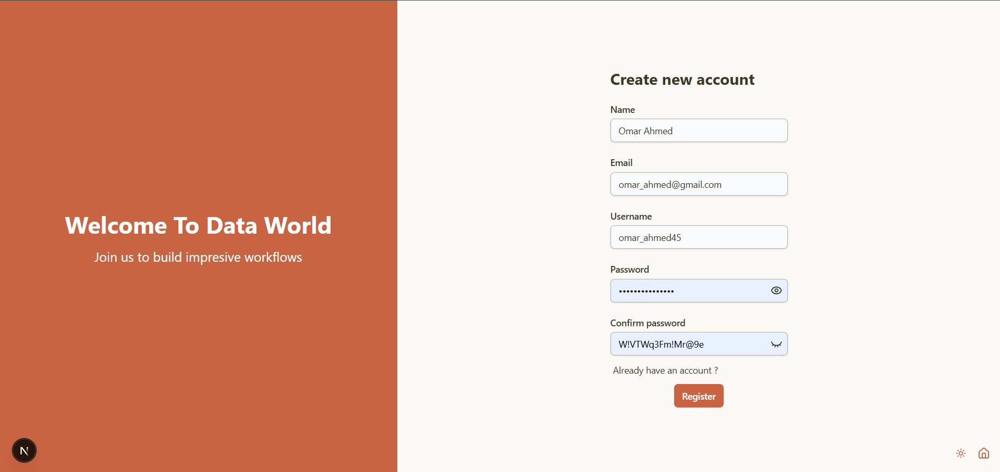
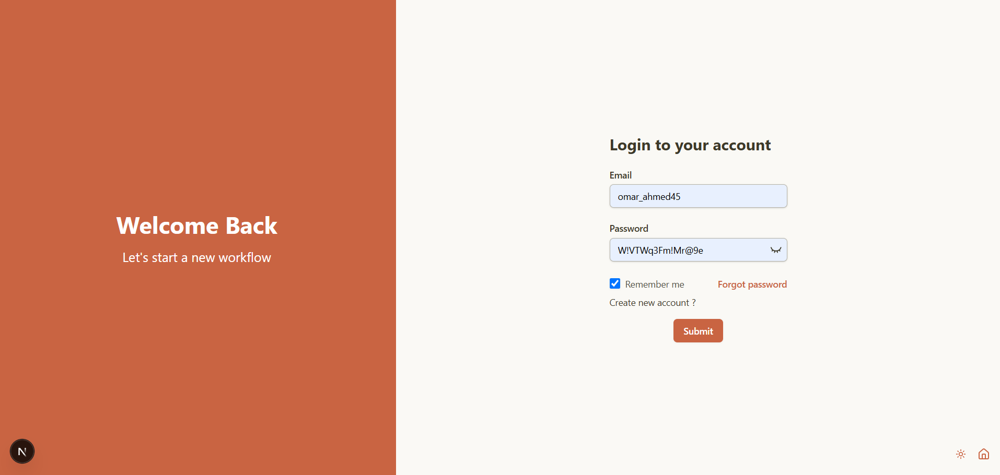
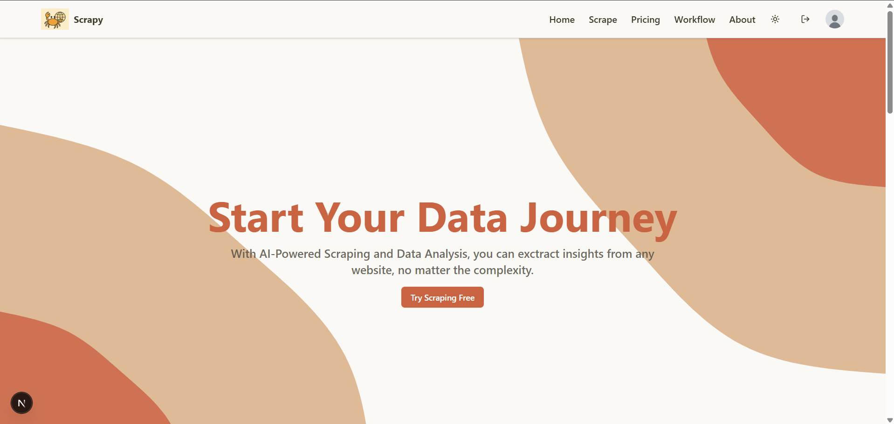
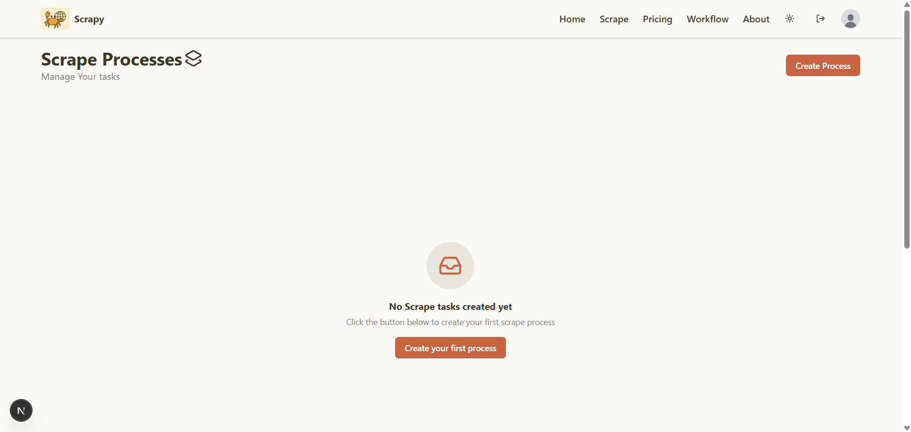
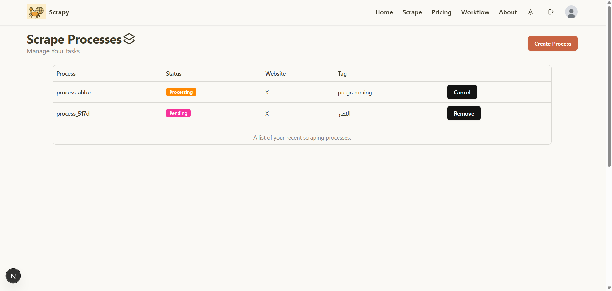
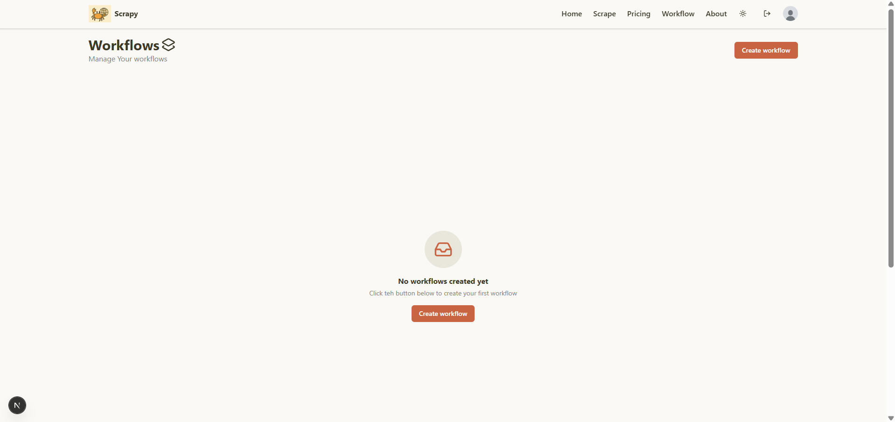
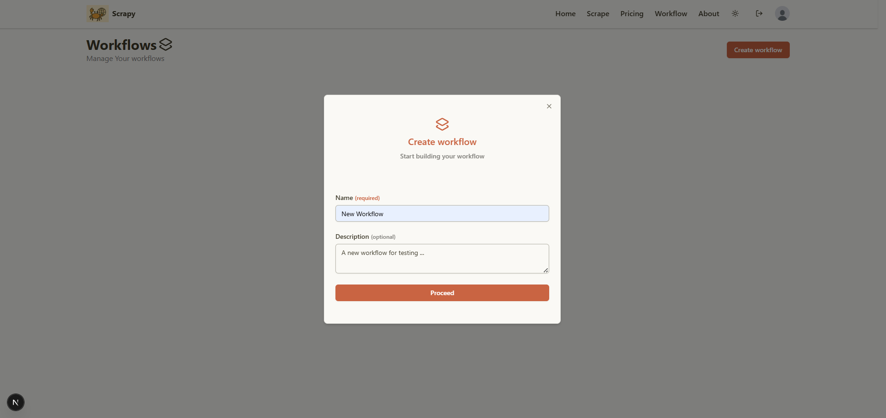
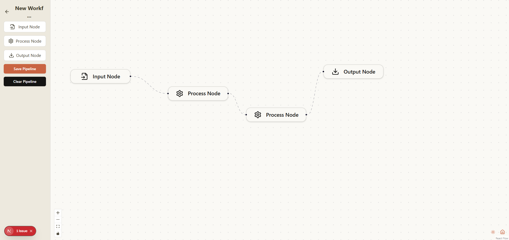
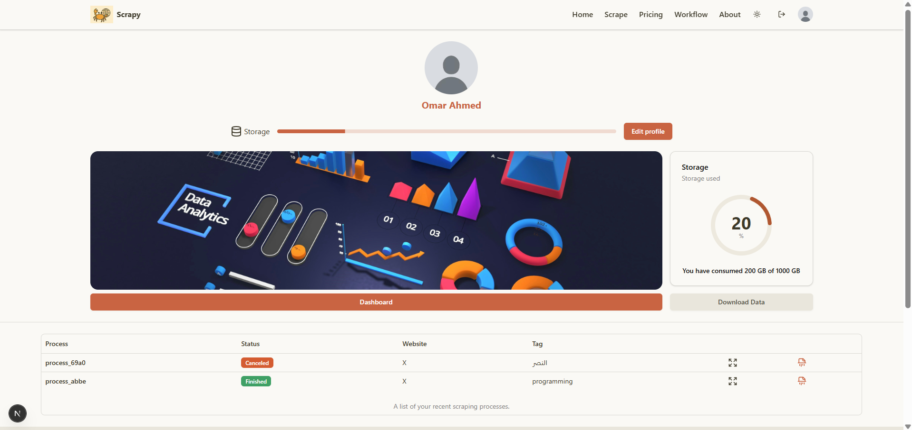
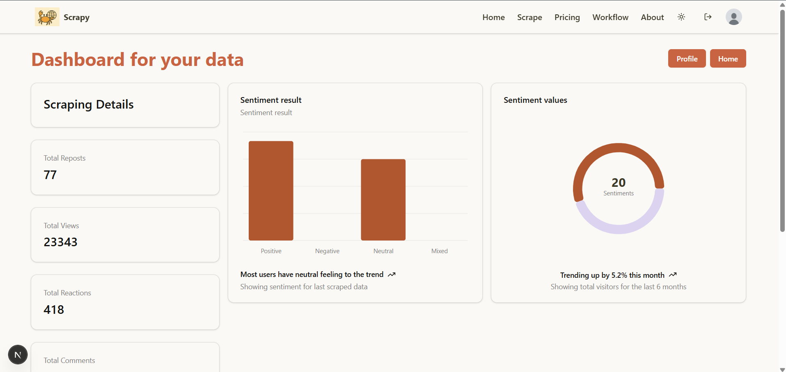

# 🚀 Social Media Analysis

> *In today's digital world, social platforms generate vast amounts of unstructured data—text, images, videos, and interactions—creating opportunities for insights and trend forecasting. With over 5.31 billion users producing 1.45 trillion GB of data daily, organizations face two major challenges: efficiently collecting data with specific parameters and analyzing it cost-effectively. Our solution addresses both by offering an all-in-one, modular system that automates data scraping, storage, analysis, and visualization across platforms like Twitter and TikTok. It features a user-friendly dashboard, secure data handling, customizable data pipelines, AI-powered analysis tools (e.g., segment and video analysis), and structured data export options (e.g., JSON), all at a lower cost than competitors.*

[](LICENSE)
[](#)
[](#)
[](#live-demo)

---

## 📋 Table of Contents

- [Overview](#overview)
- [Developers](#developers)
- [✨ Key Features](#-key-features)
- [🎯 Problem Statement](#-problem-statement)
- [🏗️ System Architecture](#️-system-architecture)
- [💻 Technology Stack](#-technology-stack)
- [📱 Illustrative Example](#-illustrative-example)
- [📈 Future Enhancements](#-future-enhancements)
- [📄 License](#-license)

---

## Overview

**Scrapy** is a full-stack web application designed to automate the process of collecting, processing, and analyzing data from different social media platforms. This project was developed as my graduation capstone project, demonstrating proficiency in modern software development practices, system design, and full-stack development.

---

## Developers
- [Ali Elshorpagi](https://github.com/Ali-Elshorpagi)
- [Ammar Gamal](https://github.com/ammar-gamal)
- [Basma Yousef](https://github.com/basmajou)
- [Amr Albaz](https://github.com/AmrAlbaz34)
- [Mohamed Said](https://github.com/mohamed-said03)

---

### 🎓 Academic Context
- **Institution**: Zagazig University
- **Program**: Computer Science (CS)
- **Duration**: September 2024 - July 2025
- **Supervisor**: [Dr. Mahmmoud A.Mahdi](https://github.com/qursaan)
- **Grade Achieved**: High Excellent (A+)

### 🎯 Business Value
> #### Problem 
Existing social media data collection and analysis tools—whether open-source (e.g., Tweepy, and Twint) or commercial (e.g., Brandwatch and Apify)—suffer from key limitations:

- They often focus on specific platforms or tasks (e.g., only Twitter, or only sentiment detection).
- Require significant technical expertise or manual setup.
- Lack modularity and flexibility in building end-to-end workflows.
- Provide limited support for non-English languages, particularly Arabic.
- Rarely integrate advanced features such as tone, implied sentiment, or video analysis.
> #### Soltion 
The proposed system is a fully modular, workflow-based platform that automates the entire pipeline—from scraping data across multiple platforms (e.g., Twitter and TikTok) to analyzing and visualizing it using AI models, including Arabic NLP support. It offers:
- A user-friendly dashboard for both technical and non-technical users.
- Customizable data pipelines with plug-and-play components.
- Advanced analytics like tone detection and text classification.
- Export options in structured formats (e.g., JSON).
- All-in-one functionality at a lower cost than commercial competitors.

---

## ✨ Key Features

### Core Functionality
- **Automated Multi-Platform Data Scraping**: Collects data from platforms like Twitter and TikTok, including trending hashtags and posts with specific tags. Users can manage and monitor multiple scraping tasks with full control, enabling efficient, real-time data collection for various use cases.
- **AI-Powered Social Media Analysis**: Offers advanced analytics like segment analysis, tone and implied sentiment detection, and video analysis. Supports multilingual content, including Arabic NLP, making it especially useful for diverse research and market needs.
- **Custom Data Pipelines & Workflow Management**: Users can build modular, end-to-end workflows—from scraping to analysis and visualization—tailored to specific project goals. Structured export options (e.g., JSON) enhance flexibility for external use.
- **Scalable & Fault-Tolerant Architecture**: Microservices-based backend with independent services for scraping, analysis, and storage. If one service or database fails, others continue running independently—ensuring high availability and seamless performance.
- **Subscription-Based Access**: Integrated with Stripe to offer monthly subscription plans. Users can upgrade to premium tiers to unlock higher usage limits including more concurrent processes, increased data scraping quotas, and advanced analytics access. The system automatically handles billing, plan changes, and secure payment processing.

### Technical Highlights
- **Responsive Design**: Fully responsive dashboard accessible across desktop, tablet, and mobile for seamless user experience.
- **Real-time Updates**: Live tracking of process status, scraping activities, and analysis results through dedicated APIs and background task monitoring.
- **Security**: Robust JWT-based authentication with refresh tokens ensures secure session handling; APIs are protected to restrict access to user-specific data.
- **Performance**: Optimized with sequential task processing, modular microservices, and isolated databases for different components to reduce bottlenecks and improve scalability.
- **Stripe Integration**: Manages user subscriptions and secure payments via Stripe, with support for plan upgrades, and automated billing.
---

## 🎯 Problem Statement

### The Challenge
Social media platforms generate 1.45 trillion GB of unstructured data daily from over 5.31 billion users, including text, images, videos, and interactions. Businesses, researchers, and analysts need to extract actionable insights from this massive data stream—but face two major challenges:
- Who faces this problem:
  - Businesses aiming to understand customer behavior and market trends.
  - Researchers and analysts conducting large-scale studies or sentiment analysis.
  - Developers and data scientists building NLP or social media tools.
- Why existing solutions are inadequate:
  - Open-source tools (e.g., Tweepy, and Twint) are limited to specific platforms, require manual configuration, and demand high technical expertise.
  - Commercial tools (e.g., Brandwatc) offer limited customization and are expensive.
  - Most systems lack multilingual support, especially for Arabic.
  - There's a lack of modular, all-in-one platforms that combine scraping, analysis, and visualization under one roof. 
- What the impact of the problem:
  - Valuable insights remain locked in unstructured data.
  - Manual, time-consuming workflows reduce productivity and slow decision-making.
  - Arabic-speaking regions and multilingual markets are underrepresented in analytics tools.

### Our Solution
We provide a modular, automated, and scalable system that streamlines the entire social media data pipeline—from scraping and storage to AI-driven analysis and visualization—supporting platforms like Twitter and TikTok.
- Key innovation or unique approach
  - All-in-one platform with microservices architecture, Arabic NLP support, and a user-friendly dashboard.
  - Enables users to define custom workflows, analyze data in real-time, and download structured results (e.g., JSON)
- How your solution differs from alternatives
  - More flexible and cost-effective than commercial tools
  - Easier to use and more powerful than fragmented open-source tools
  - Offers video analysis, tone/implied sentiment detection, and real-time process management—features often missing in other platforms
### Target Audience
- Businesses (marketing teams, product managers)
- Researchers and academics (with or without technical backgrounds)
- Data analysts and scientists needing scalable, customizable pipelines

---

## 🏗️ System Architecture

### High-Level Architecture


### Component Breakdown
>- **Frontend Layer**:
  - Provides a fully responsive UI for all users (desktop, tablet, mobile).
  - Allows users to register, login, manage subscriptions, and visualize results.
  - Features a drag-and-drop workflow builder for task customization.
  - Uses ReactFlow for node-based scraping pipeline design.
  - Stripe is integrated for secure payment handling.
>- **Backend Layer**:
  - **Management Service**: Handles auth, request routing, dashboards.
  - **Scrape Service**: Manages scraping tasks (Twitter, TikTok) using Selenium.
  - **AI Analysis Service**: Performs NLP tasks using PyTorch, Transformers, Arabic-specific models.
  - **Data-Handler Service**: Downloads and organizes video content.
  - **Scrape-Resource Service**: Stores and retrieves scraped content and metadata.
  - **User-Resource Service**: Manages user data and profile history.
>- **AI Layer**: 
- - to-be added
---

## 💻 Technology Stack

### Frontend
```javascript
// Core Technologies
React 19.1               // UI Library
Next.js 15.4.2           // Server-Side Rendering
Tailwind CSS 4.1.11      // Styling Framework
ReactFlow 11.11.4        // Building Node-Based Visual Editors
```

### Backend
```javascript
// Server & API
ASP.NET Core 8.0.18              // Web Framework
Entity Framework Core 8.0.15     // ORM
Selenium 4.34.0                  // Web Automation Framework
JWT                              // Token-Based Authentication
```

### Database & Storage
```sql
-- Database
PostgreSQL 17.5     -- Primary Database
```
---

## 📱 Illustrative Example
Let’s go on a journey on our website to see how to register and process a scraping task step-by-step.

### Register


### Login


### Home


### Scrapy Landing


### Scrapy Dialog


### Scrapy Processes


### Workflow Landing


### Workflow Dialog


### Workflow


### Profile


### Dashboard



---

## 📈 Future Enhancements
- **Support for more platforms:** We plan to support more social media platforms to collect and analyze data from a wider range
- **Add more AI models:** We will include more types of analysis, such as models that can analyze videos or handle different kinds of content
- **Improve Accuracy:** We will work on improving the accuracy of the existing models to make the results more reliable
- **Enhance performance and architecture:** we plan to improve the system's speed and stability by implementing the microservice architecture
 
---

## 📄 License

This project is licensed under the MIT License - see the [LICENSE](LICENSE) file for details.

```
MIT License

Copyright (c) 2025 GOGO Team

Permission is hereby granted, free of charge, to any person obtaining a copy
of this software and associated documentation files (the "Software"), to deal
in the Software without restriction...
```


<div align="center">

**⭐ Star this repository if you found it helpful!**

Made with ❤️ by GOGO Team | © 2025 All Rights Reserved

[⬆ Back to Top](#-social-media-analysis)

</div>
